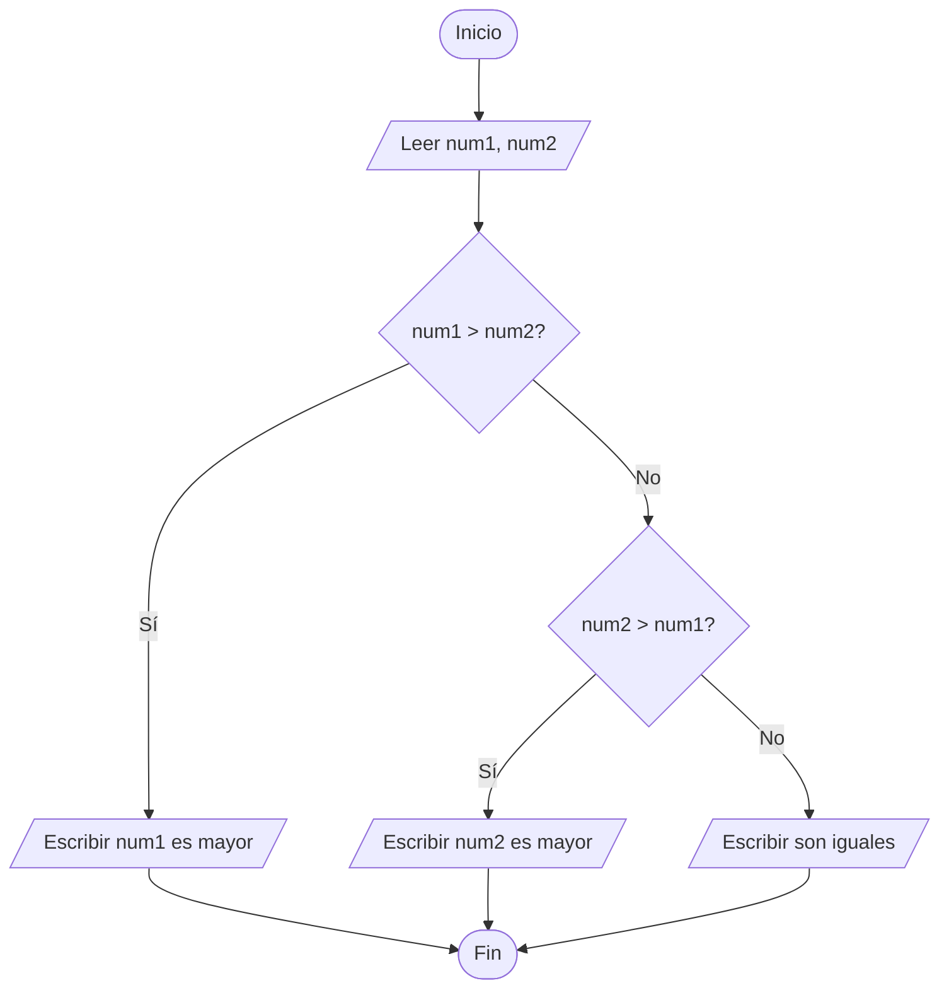
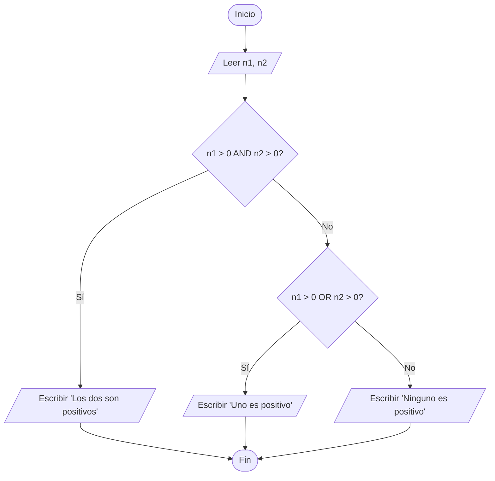
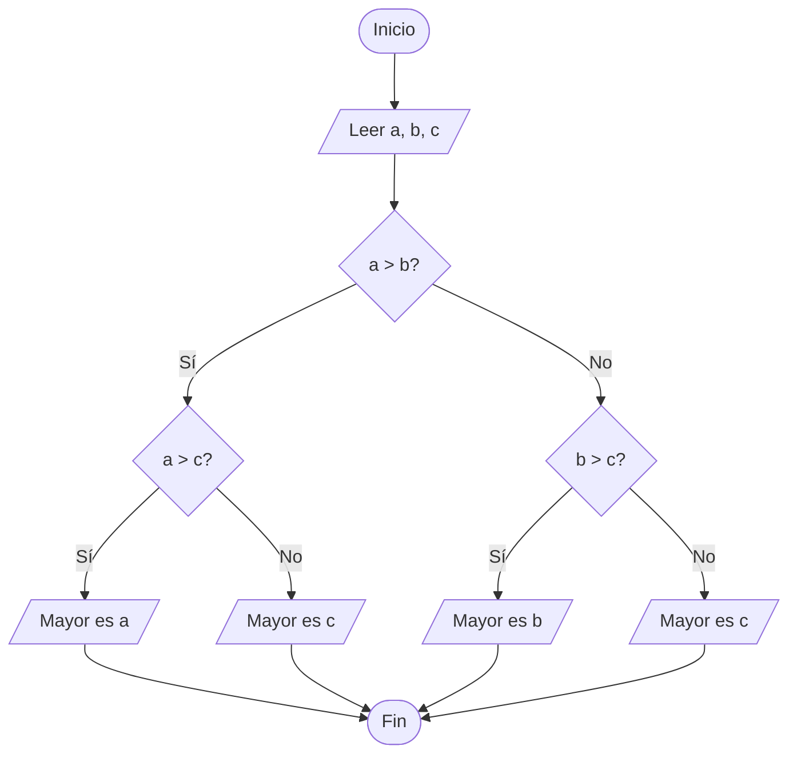
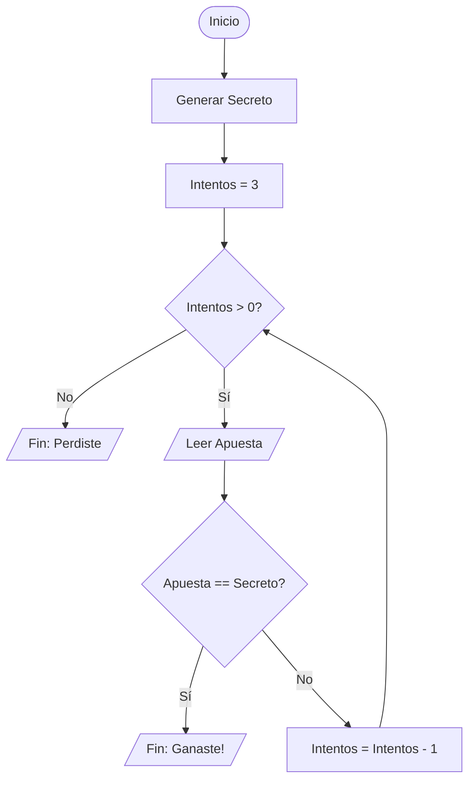

# Diagramas de Flujo - Ejercicios de Lógica

Aquí tienes la representación de los diagramas de flujo solicitados.

---

### 🟢 Ejercicio 52: Mayor de dos números

---

### 🟢 Ejercicio 53: Positivos (Uno, ambos o ninguno)

---

### 🟢 Ejercicio 54: Mayor de tres números

---

### 🟢 Ejercicio 70: Adivinar número (3 intentos)

