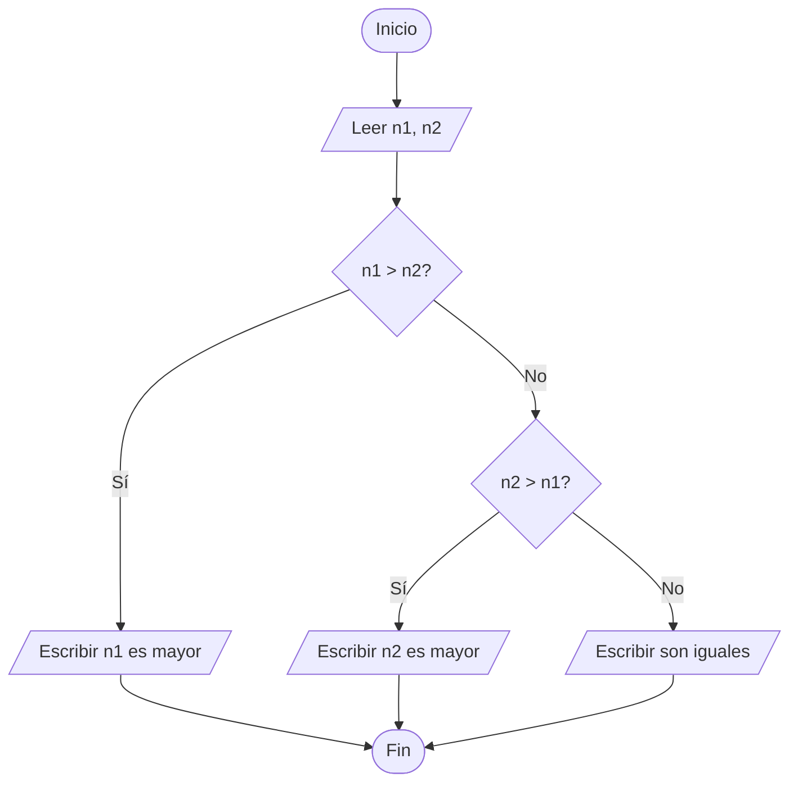

# Ejercicio 52: Mayor de dos números

```mermaid
graph TD
    A([Inicio]) --> B[/Leer n1, n2/]
    B --> C{n1 > n2?}
    C -- Sí --> D[/Escribir n1 es mayor/]
    C -- No --> E{n2 > n1?}
    E -- Sí --> F[/Escribir n2 es mayor/]
    E -- No --> G[/Escribir son iguales/]
    D --> H([Fin])
    F --> H
    G --> H
```
