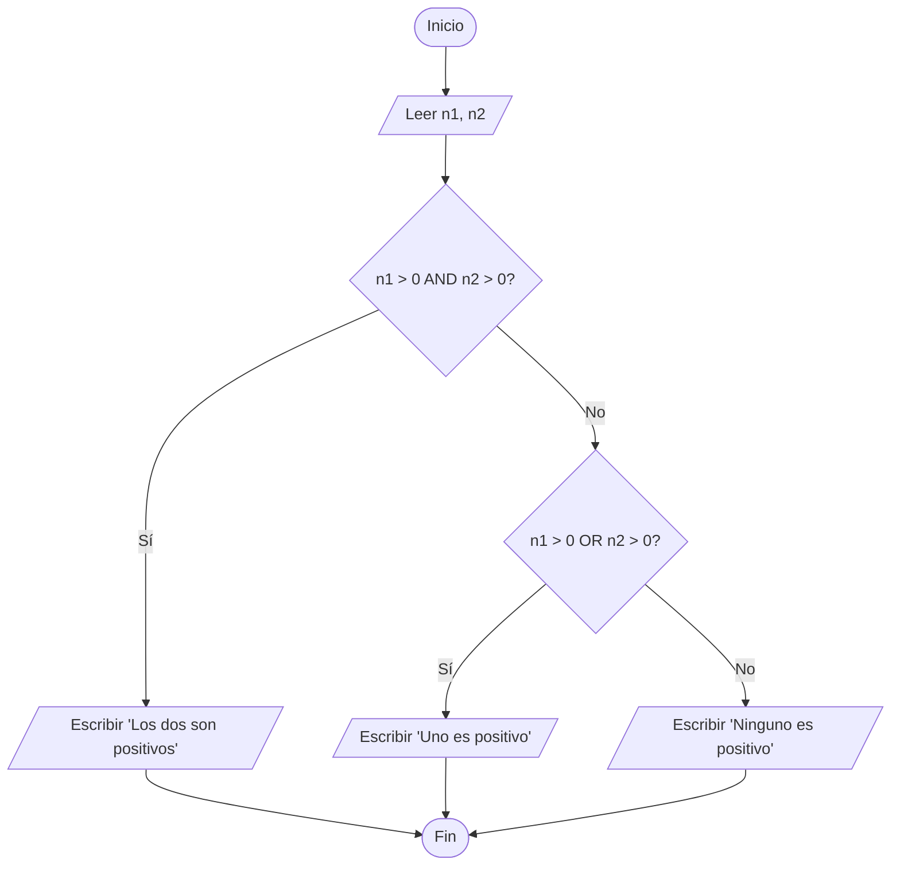

# Ejercicio 53: Uno, ambos o ninguno positivo

```mermaid
graph TD
    A([Inicio]) --> B[/Leer n1, n2/]
    B --> C{n1 > 0 AND n2 > 0?}
    C -- Sí --> D[/Escribir 'Los dos son positivos'/]
    C -- No --> E{n1 > 0 OR n2 > 0?}
    E -- Sí --> F[/Escribir 'Uno es positivo'/]
    E -- No --> G[/Escribir 'Ninguno es positivo'/]
    D --> H([Fin])
    F --> H
    G --> H
```
