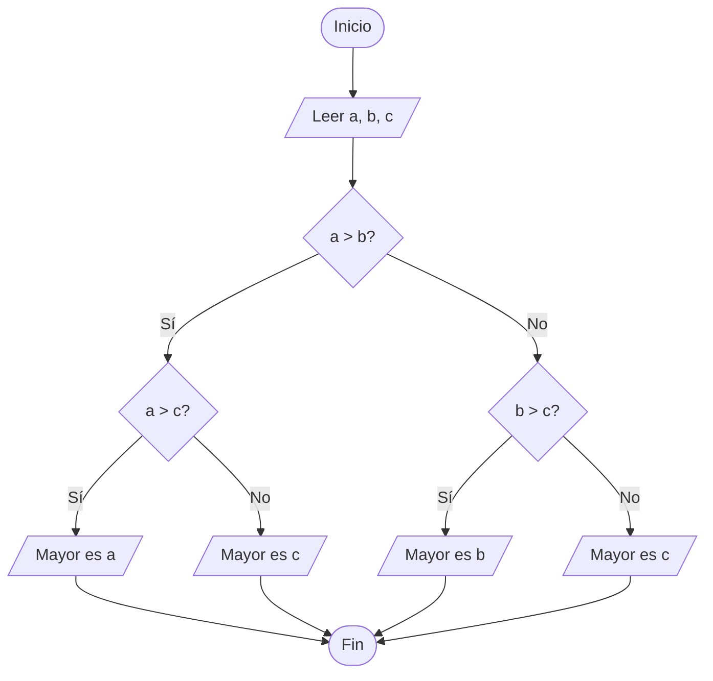

# Ejercicio 54: Mayor de tres números

```mermaid
graph TD
    A([Inicio]) --> B[/Leer a, b, c/]
    B --> C{a > b?}
    C -- Sí --> D{a > c?}
    D -- Sí --> E[/Mayor es a/]
    D -- No --> F[/Mayor es c/]
    C -- No --> G{b > c?}
    G -- Sí --> H[/Mayor es b/]
    G -- No --> I[/Mayor es c/]
    E --> J([Fin])
    F --> J
    H --> J
    I --> J
```
