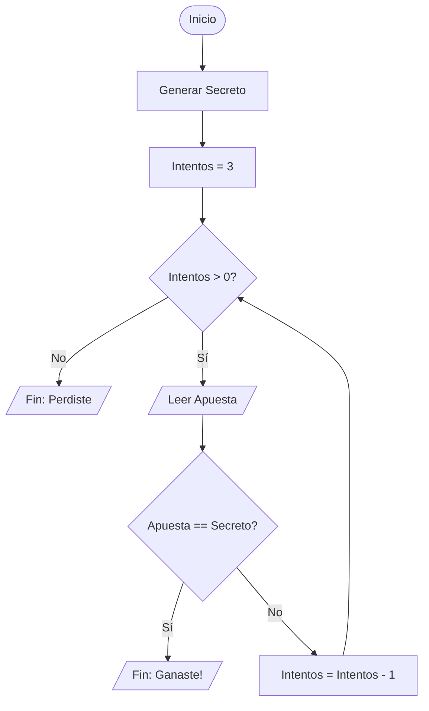

# Diagrama de Flujo: Adivinar número (3 intentos)

```mermaid
graph TD
    A([Inicio]) --> B[Generar Secreto]
    B --> C[Intentos = 3]
    C --> D{Intentos > 0?}
    D -- No --> E[/Fin: Perdiste/]
    D -- Sí --> F[/Leer Apuesta/]
    F --> G{Apuesta == Secreto?}
    G -- Sí --> H[/Fin: Ganaste!/]
    G -- No --> I[Intentos = Intentos - 1]
    I --> D
```
